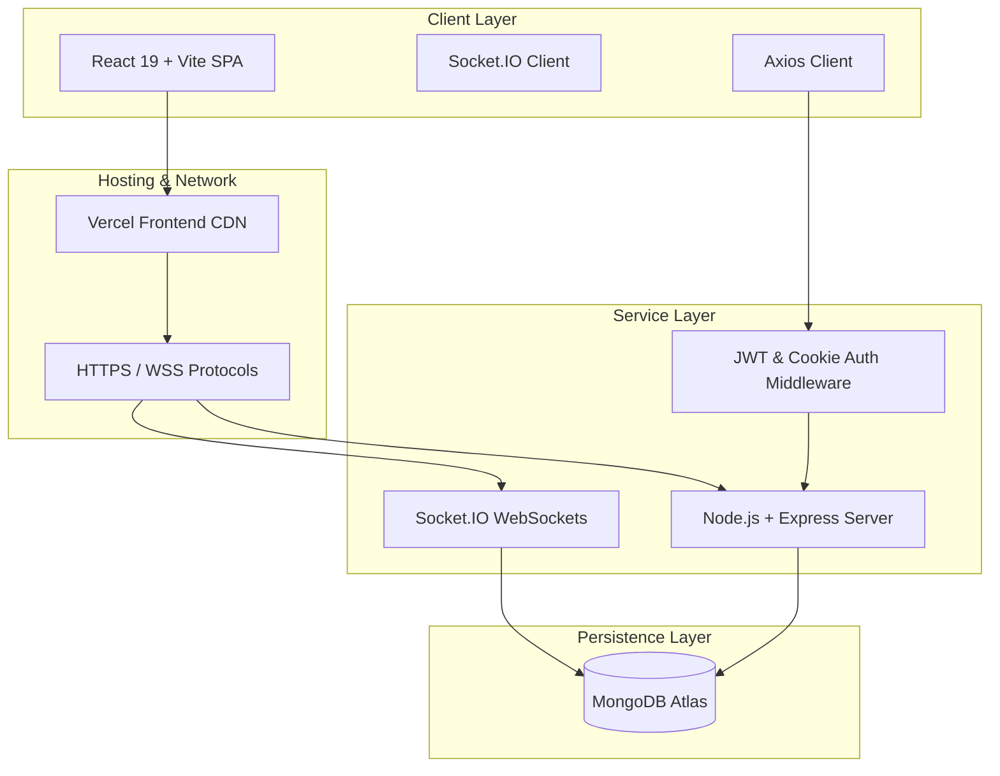
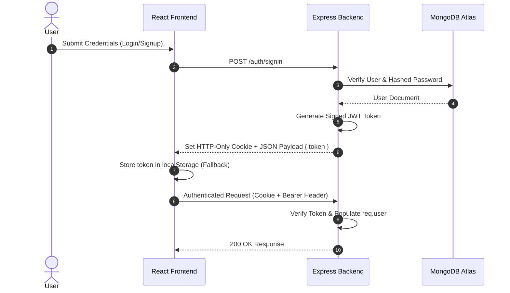
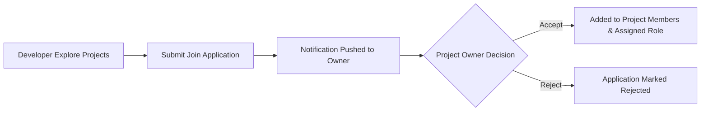
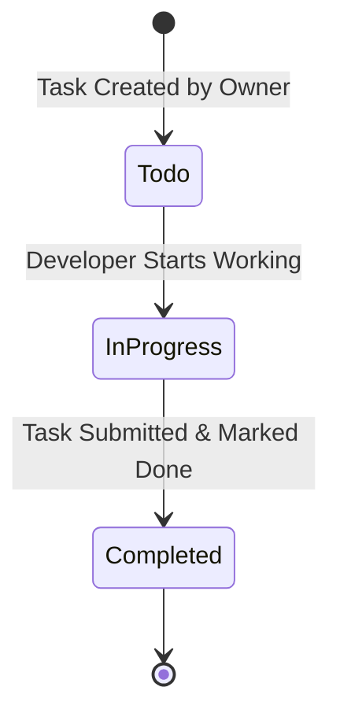
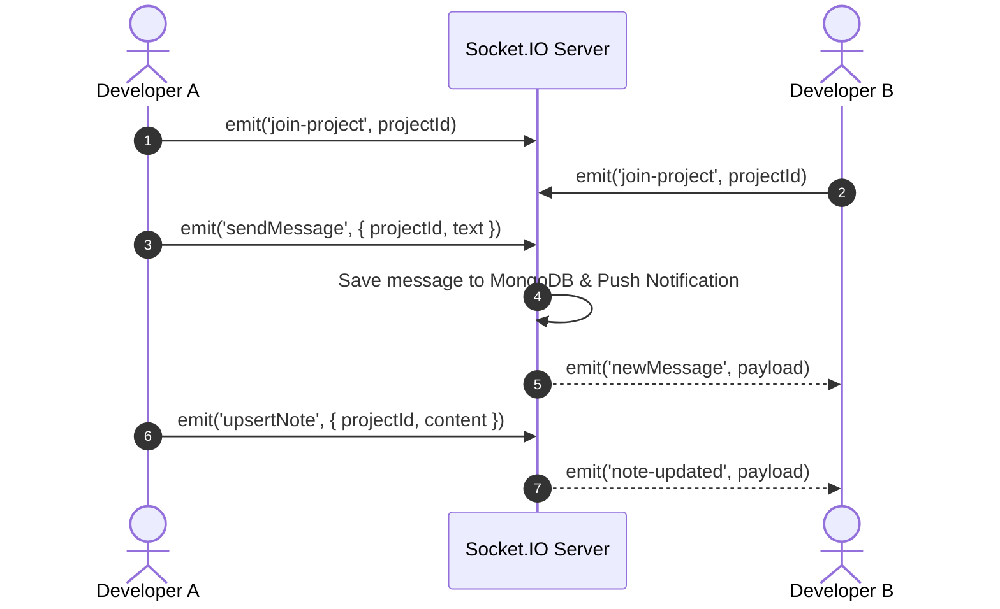

# 🚀 DevCollab — Developer Collaboration Platform

> **Main Frontend Repository** | *Looking for the backend API repository? Visit [DevCollab Backend Repository](https://github.com/vrushabhdarekar22/DevCollab-backend)*

DevCollab is a production-grade, full-stack developer collaboration platform that bridges the gap between project ideas and execution. It enables developers to showcase software projects, recruit skilled teammates, manage tasks through Kanban workflows, collaborate on live workspace notes, and communicate in real-time.

---

## 🔗 Project Repositories & Live Links

| Component | Repository Link | Deployed Endpoint |
| :--- | :--- | :--- |
| **Frontend App** | [👉 DevCollab Frontend](https://github.com/vrushabhdarekar22/DevCollab-frontend) | [🌐 Live Application](https://dev-collab-frontend-79h6.vercel.app/) |
| **Backend API** | [👉 DevCollab Backend](https://github.com/vrushabhdarekar22/DevCollab-backend) | [⚙️ REST API & WebSockets](https://devcollab-backend-1.onrender.com) |

---

## 🎯 Problem Statement & Solution

Developers often struggle to find reliable collaborators for side projects, hackathons, or open-source initiatives. Project management is frequently fragmented across separate platforms for messaging, task tracking, and developer recruitment.

**DevCollab solves this by integrating:**
1. **Developer Recruitment**: Post project openings with specified technical roles and accept/reject join applications.
2. **Kanban Task Management**: Assign tasks, set priorities, track deadlines, and monitor project status (`Todo` → `In Progress` → `Completed`).
3. **Real-Time Collaboration**: Instant project chat rooms and shared live notes powered by Socket.IO.
4. **Activity Notifications**: Automated notifications for join applications, task assignments, and workspace messages.

---

## 🏗️ System Architecture

DevCollab is architected as a decoupled, multi-repository system with an independent React SPA on the frontend and an Express REST API + WebSocket server on the backend.



---

## 💻 Tech Stack

### **Frontend App** ([Repository Link](https://github.com/vrushabhdarekar22/DevCollab-frontend))
| Technology | Purpose |
| :--- | :--- |
| **React 19** | Declarative Component-driven User Interface |
| **Vite 8** | Next-Generation Frontend Tooling & Fast HMR |
| **Tailwind CSS v4** | Modern Glassmorphism & Responsive Styling |
| **React Router v7** | Single Page Application Client-side Routing |
| **Axios** | HTTP Client with Cookie credentials & Bearer token fallback |
| **Socket.IO Client** | Event-driven WebSocket client for real-time chat & notes |
| **Lucide React** | Production-ready icon system |

### **Backend API** ([Repository Link](https://github.com/vrushabhdarekar22/DevCollab-backend))
| Technology | Purpose |
| :--- | :--- |
| **Node.js** | Event-driven JavaScript runtime environment |
| **Express.js v5** | High-performance RESTful API Framework |
| **MongoDB Atlas** | Distributed Cloud NoSQL Database |
| **Mongoose ODM** | Data modeling and schema validation |
| **JSON Web Tokens (JWT)** | Stateless authentication token generation |
| **Socket.IO Server** | Real-time WebSocket server for rooms & messaging |
| **Nodemailer** | Transactional SMTP email delivery (OTP & resets) |

---

## 🔐 Core Features & Engineering Implementation

### 1. 🔑 Authentication & Authorization
* **Dual-Layer Authentication**: Authentication is handled via signed JSON Web Tokens (JWT). The system sets an **HTTP-only cookie** (`token`) for standard web sessions and provides an **Authorization Bearer header fallback** in localStorage for cross-domain resilience.
* **Protected Routes & Middlewares**: Custom Express middleware (`checkForAuthenticationCookie`) decodes tokens, verifies user credentials against MongoDB, and injects `req.user`.



---

### 2. 📁 Project Management & Recruitment Workflow
* **Project Creation**: Users can create projects detailing tech stack requirements, project descriptions, and open roles with specific target counts.
* **Project Discovery (Explore)**: Filter and discover open-source or team projects looking for contributors.
* **Recruitment System**: Applicants submit join requests with custom pitch messages and desired roles. Project owners review pending requests and accept or reject candidates.



---

### 3. ✅ Kanban Task Management
* **Project Taskboard**: Workspace task tracking across three stages: `Todo` → `In Progress` → `Completed`.
* **Task Assignment & Metrics**: Assign tasks to specific project members with assigned priority levels (`Low`, `Medium`, `High`), due dates, and required technical roles.



---

### 4. 💬 Real-Time Workspace Communication & Shared Notes
* **Workspace Chat Rooms**: Powered by Socket.IO, project collaborators can join isolated socket channels (`project-{id}`) for instant messaging.
* **Live Shared Notes**: Collaborative workspace documentation supporting live socket broadcast (`note-updated`) so team members see real-time updates without refreshing.



---

### 5. 🔔 Notification Engine
* **Real-time & Persistent Alerts**: System notifications generated when:
  * A developer submits a join request for a project.
  * An application is accepted or rejected.
  * A new chat message is posted in the project workspace.
  * A task is assigned to a member.

---

## 📦 Repositories & Directory Layout

Because **DevCollab** is separated into independent repositories, each codebase can be developed, tested, and deployed individually.

### **Frontend Repository Structure** ([Current Repository](https://github.com/vrushabhdarekar22/DevCollab-frontend))
```text
DevCollab-Frontend/
├── public/
├── src/
│   ├── api/
│   │   └── api.js                 # Centralized Axios instance with Bearer interceptor
│   ├── components/
│   │   ├── layout/                # Navbar, AuthLayout
│   │   ├── project/               # Project-specific UI components
│   │   └── ui/                    # ThemeToggle, NotificationBell, Toast
│   ├── pages/
│   │   ├── auth/                  # Login, Register, ForgotPassword, ResetPassword
│   │   ├── profile/               # User Profile & Edit Profile modal
│   │   ├── projects/              # Explore, MyProjects, ViewProject, Requests
│   │   └── workspace/             # Workspace Hub (Dashboard, Tasks, Chat, Notes, Members)
│   ├── App.jsx                    # Route definitions & global providers
│   ├── main.jsx                   # React root entrypoint
│   └── index.css                  # Tailwind CSS v4 directives
├── package.json
└── vite.config.js
```

### **Backend Repository Structure** ([Backend Repository](https://github.com/vrushabhdarekar22/DevCollab-backend))
```text
DevCollab-Backend/
├── controllers/                   # Route controller logic (auth, user, project, task, note, notification)
├── middlewares/                   # Authentication & authorization middlewares
├── models/                        # Mongoose schemas (user, project, task, note, message, notification)
├── routes/                        # Express API route declarations
├── services/                      # Authentication token services & notifications
├── index.js                       # Server startup, Express middlewares, Socket.IO initialization
└── package.json
```

---

## 🔒 Security Practices

* **HTTP-Only Cookies & Bearer Tokens**: Auth tokens are issued as `httpOnly` cookies in production (`SameSite=None; Secure`) and supported via Bearer Authorization headers for cross-domain reliability.
* **Password Hashing**: Secure password hashing using salt and hash functions (`crypto` / `bcryptjs`).
* **Cross-Origin Resource Sharing (CORS)**: Strict CORS policies configured dynamically for trusted deployment origins (`CLIENT_URL` and `CORS_ORIGINS`).
* **Environment Variable Hygiene**: All API keys, database connection strings, and JWT secrets are strictly managed via `.env` files and omitted from version control.

---

## ⚙️ Local Development Setup

### 1. **Backend Setup** ([Backend Repository](https://github.com/vrushabhdarekar22/DevCollab-backend))

```bash
# Clone the Backend Repository
git clone https://github.com/vrushabhdarekar22/DevCollab-backend.git
cd DevCollab-backend

# Install dependencies
npm install

# Create environment file
cp .env.example .env
```

Configure your local `Backend/.env` file:
```env
PORT=8000
NODE_ENV=development
MONGO_URL=your_mongodb_connection_string
JWT_SECRET=your_jwt_secret_key
CLIENT_URL=http://localhost:5173
CORS_ORIGINS=http://localhost:5173,http://127.0.0.1:5173
```

Start the backend server:
```bash
npm run dev
# Backend server runs at http://localhost:8000
```

---

### 2. **Frontend Setup** ([Current Repository](https://github.com/vrushabhdarekar22/DevCollab-frontend))

```bash
# Clone the Frontend Repository
git clone https://github.com/vrushabhdarekar22/DevCollab-frontend.git
cd DevCollab-frontend

# Install dependencies
npm install

# Create environment file
cp .env.example .env
```

Configure your local `Frontend/.env` file:
```env
VITE_API_URL=http://localhost:8000
```

Start the Vite development server:
```bash
npm run dev
# Frontend app runs at http://localhost:5173
```

---

## ☁️ Production Deployment Architecture

```text
               User Web Browser
                      │
           ┌──────────┴──────────┐
           │                     │
      HTTPS/WSS               HTTPS/WSS
           │                     │
           ▼                     ▼
┌────────────────────┐  ┌─────────────────────────────┐
│  Frontend (Vercel) │  │   Backend API (Render)      │
│  React 19 + Vite   │  │   Node.js + Express Server  │
└────────────────────┘  └──────────────┬──────────────┘
                                       │
                                   MongoDB Wire
                                       │
                                       ▼
                            ┌─────────────────────┐
                            │ MongoDB Atlas Cloud │
                            └─────────────────────┘
```

* **Frontend Hosting**: Deployed on **Vercel** ([dev-collab-frontend-79h6.vercel.app](https://dev-collab-frontend-79h6.vercel.app/)) with automated CI/CD deployments.
* **Backend Hosting**: Deployed on **Render** (`https://devcollab-backend-1.onrender.com`) running Node.js with environment-driven CORS configuration.
* **Database**: Hosted on **MongoDB Atlas** with automated cluster backups and network access control.

---

## 💡 Engineering Challenges & Solutions

### 1. **Cross-Domain Cookie Authentication (Vercel → Render)**
* **Challenge**: When deploying the frontend on Vercel (`dev-collab-frontend-79h6.vercel.app`) and backend on Render (`devcollab-backend-1.onrender.com`), browsers treat cookies as third-party and reject standard `SameSite=Lax` cookies.
* **Solution**: Implemented dynamic cookie attributes (`sameSite: "none"`, `secure: true` in production) combined with a dual-authentication model using an **Axios Bearer Token request interceptor** as a fallback.

### 2. **WebSocket Authentication & Room Management**
* **Challenge**: Socket.IO clients were unable to read `httpOnly` authentication cookies directly in browser JavaScript, leading to socket connection failures.
* **Solution**: Enhanced the Socket.IO server handshake middleware to verify tokens extracted from both `socket.handshake.auth.token` (localStorage fallback) and cookie headers, ensuring seamless real-time chat and live notes sync.

### 3. **Circular Module Dependencies in Express Controllers**
* **Challenge**: Controllers requiring the initialized `io` instance directly from `index.js` caused circular dependency issues during startup, leading to unhandled runtime errors during socket emissions.
* **Solution**: Implemented a dynamic lazy-loader getter function (`getIO()`) inside controllers to retrieve the active Socket.IO server instance at request execution time.

---

## 🔮 Future Enhancements

* [ ] **GitHub Repository Integration**: Automatically fetch repository stars, open issues, and commit history for projects.
* [ ] **AI-Powered Teammate Matching**: Match developer skill sets with open project role requirements using semantic embeddings.
* [ ] **Code Review & Snippet Sharing**: Embedded code editor inside project workspace notes for inline code reviews.
* [ ] **Calendar & Deadline Sync**: Export project deadlines to Google Calendar or iCal format.

---

## 👨‍💻 Authors & Contributors

| Developer | Information | Links |
| :--- | :--- | :--- |
| **Vrushabh Darekar** | B.E. Information Technology<br>Pune Institute of Computer Technology (PICT), Pune | [GitHub](https://github.com/vrushabhdarekar22) • [LinkedIn](https://linkedin.com/in/vrushabh-darekar) |
| **Harshad Kavade** | B.E. Computer Technology<br>Pune Institute of Computer Technology (PICT), Pune | [GitHub](https://github.com/HarshadKavade) • [LinkedIn](https://www.linkedin.com/in/harshad-kavade-7a1941294/) |
